Table of Contents
- [Where the last article left off](#recap)
- [The setup](#setup)
- [How I profile](#how)
- [Round 0: profile the baseline](#round0)
- [Round 1: tile sizes, `num_warps` and `num_stages`](#round1)
  - [The shared-memory budget for an Ada SM](#budget)
  - [The sweep](#sweep)
  - [The heatmaps](#heatmaps)
  - [The winner, through the unchanged harness and tests](#winner)
- [Round 2: profile the tuned kernel](#round2)
- [Round 3: wrap the winner in `@triton.autotune`, and what it costs](#round3)
- [Round 4: inside the inner loop](#round4)
  - [Causal tile-skipping](#skip)
  - [`exp2`](#exp2)
  - [The P cast](#pcast)
- [Round 5: re-tune, then the final profile](#round5)
- [What to look for, as a checklist](#checklist)
- [Results](#results)
- [Future articles](#future)

In the [previous article](PREVIOUS_ARTICLE_URL) I wrote the FlashAttention-2 forward pass in Triton with 16×16 tiles. It was correct, and it was slow: about 22 TFLOP/s, 32% of PyTorch's `scaled_dot_product_attention` (SDPA) at N = 4096, and 18% for causal attention. That article ended with a list of things I believed were wrong with the kernel, and a confession: none of it had been checked with a profiler.

This article checks it. The method is a loop, repeated five times:

1. **Profile** the kernel and write down what the profile shows, before deciding anything.
2. **Change one thing** that the profile points at.
3. **Measure** with the unchanged benchmark harness and run the unchanged test file.
4. **Profile again**, to confirm the change did what I expected and to find the next thing.

The two jobs from the previous article's list come in that order. The first is outside the inner loop: change the tile sizes, `num_warps` and `num_stages`, work through the shared-memory budget of an Ada SM, sweep the configuration space, draw the heatmap, and wrap the winner in `@triton.autotune` and measure what that costs in compile time. The second is inside the inner loop: skip the tiles that causal masking throws away, switch `exp` to `exp2`, and look at what the cast of `P` to bf16 really compiles to. Along the way there are screenshots of Nsight Systems and Nsight Compute, including the roofline, with notes on exactly which numbers I read and why.

The benchmark harness (`bench_flashattention.py`) and the test file (`test_flashattention_triton.py`) are byte-for-byte the ones from the previous article, so every number here can be compared with the numbers there. The only file that changes is `flashattention_autograd_function_triton.py`.

The short version, at N = 4096 with the harness's own numbers (medians of three runs):

| | Previous article's kernel | This article's kernel | SDPA |
|---|---|---|---|
| Non-causal | 6.40 ms, 21.5 TFLOP/s, 32% of SDPA | 1.95 ms, 70.3 TFLOP/s, 103% of SDPA | 2.01 ms, 68.4 TFLOP/s |
| Causal | 6.43 ms, 10.7 TFLOP/s, 18% of SDPA | 1.08 ms, 63.8 TFLOP/s, 104% of SDPA | 1.12 ms, 61.3 TFLOP/s |

Most of that came from two changes, and the profiler pointed at both: a tile size and warp count that give every warp its own rows (3×), and not computing the tiles that causal masking throws away (another 2× for causal). `exp2` and autotuning were worth a few percent each. The kernel is now within 10% of the tensor cores' peak, as is SDPA.

All numbers are from the same RTX 4070 SUPER under Linux. This article assumes you have read the previous one, or are comfortable with the FlashAttention-2 forward pass and basic Triton. This article was written with the assistance of AI. If you spot any mistakes, please let me know.

<a id="recap">
## Where the last article left off
</a>

The kernel gives each program one tile of 16 query rows and loops over all keys in tiles of 16, keeping the running max `m`, the running sum `l` and the unnormalised output `O` in fp32. The launch used Triton's defaults for everything I had not thought about: 4 warps per program and 3 pipeline stages. Its list of suspected problems, in the order I planned to fix them:

1. The tiles are too small.
2. Causal attention computes every tile and masks half of them away.
3. `tl.exp` instead of `tl.math.exp2`.
4. The `-1e6` mask sentinel.
5. No backward pass.
6. The mask is computed on every tile.
7. No profile.

This article is about 7, then 1, then 2, 3 and 6, and a look at the cast of `P` that the previous article fixed but never measured. The backward pass is still for a future article.

<a id="setup">
## The setup
</a>

### The GPU

Every decision below depends on a few numbers about the GPU, so here they are in one place. The first group comes from `torch.cuda.get_device_properties`, Triton's `driver.active.utils.get_device_properties()` and NVIDIA's documentation for compute capability 8.9. The last three rows are measured.

| | RTX 4070 SUPER |
|---|---|
| Architecture | Ada Lovelace (AD104), compute capability 8.9, `sm_89` |
| Streaming multiprocessors (SMs) | 56 |
| Registers per SM | 65,536 32-bit registers, at most 255 per thread |
| Resident threads per SM | up to 1,536 (48 warps) in up to 24 blocks |
| L1 + shared memory per SM | 128 KB, of which up to 100 KB (102,400 bytes) can be shared memory |
| Shared memory per block (program) | up to 99 KB (101,376 bytes), plus 1 KB the driver reserves for every block |
| L2 cache | 48 MB |
| DRAM | 12 GB GDDR6X, 504 GB/s peak |
| Tensor-core peak, bf16 inputs with fp32 accumulation | 512 FLOP per clock per SM, so 72.2 TFLOP/s at the 2.52 GHz Nsight Compute ran at |
| cuBLAS bf16 matmul, 8192 × 8192 × 8192 (measured) | 69.4 TFLOP/s |
| Device-to-device copy (measured) | 392 GB/s |

Two of these deserve a comment.

First, the tensor-core peak. On GeForce Ada cards, matrix multiplies with fp32 accumulation run at half the rate of those with fp16 accumulation. Nsight Compute lists the peak for "bf16 in, fp32 out" as 512 operations per clock per SM against 1,024 for "fp16 in, fp16 out". Attention needs fp32 accumulation, so the ceiling for this whole article is about 72 TFLOP/s, and cuBLAS reaching 69.4 TFLOP/s on a large matmul says that ceiling is real. In the previous article SDPA reached 68.4 TFLOP/s at N = 4096, which is about 95% of it. That is the bar.

Second, shared memory. An A100 has 164 KB of shared memory per SM and an H100 228 KB, and the tile sizes in the FlashAttention-2 paper were chosen for budgets like those. Ada has 100 KB per SM and 99 KB per program. That number decides which configurations can run at all, and it gets its own section below.

### Software and files

PyTorch 2.11 (CUDA 13.0), Triton 3.6.0, Nsight Systems 2026.1.3, Nsight Compute 2026.2.1, driver 595.91. Each version of the kernel lives in its own folder with the same file name, `flashattention_autograd_function_triton.py`, so the unchanged harness and the unchanged test file can import whichever one is on the path:

```bash
PYTHONPATH=kernels/v1_tiles python bench_flashattention.py
PYTHONPATH=kernels/v1_tiles python -m pytest -q test_flashattention_triton.py
```

| Folder | What changes |
|---|---|
| `kernels/v0_baseline` | the kernel from the previous article, unchanged |
| `kernels/v1_tiles` | the same kernel body, with the tile sizes, `num_warps` and `num_stages` from the sweep |
| `kernels/v2_autotune` | v1 wrapped in `@triton.autotune` |
| `kernels/v3_causal_skip` | the key loop split into unmasked tiles, diagonal tiles, and nothing above the diagonal |
| `kernels/v4_exp2` | v3 with the softmax scale and log₂e folded into one multiply-add, and `exp2` |
| `kernels/v5_final` | v4 wrapped in `@triton.autotune`, with configurations from a second sweep |

Everything else behind the numbers and figures in this article (the sweep, the profiling drivers, the compile-cost measurements, the plotting scripts and the raw results) sits next to the kernels in `2026_10_03_followup/`.

### The baseline, re-measured

Before changing anything I re-ran the unchanged harness on the unchanged kernel, to check that today's GPU gives the same numbers as the day the previous article was written (today's numbers are medians of three runs):

| N | causal | previous article (ms) | today (ms) | today's SDPA (ms) |
|---|---|---|---|---|
| 512 | no | 0.107 | 0.114 | 0.066 |
| 1024 | no | 0.386 | 0.385 | 0.152 |
| 2048 | no | 1.534 | 1.528 | 0.538 |
| 4096 | no | 6.195 | 6.399 | 2.008 |
| 4096 | yes | 6.155 | 6.427 | 1.121 |

The two agree to within about 5% (a little more for the 0.1 ms kernels at N = 512), and SDPA moves by a similar amount between runs: 2.009 ms then, anywhere from 2.0 to 2.2 ms in single runs today. The card is power-limited under sustained tensor-core load: it drew 218 W of its 220 W limit during the cuBLAS run above, so the clock it holds depends a little on temperature. I treat differences under about 3% between two runs as noise, and run the harness twice whenever a decision depends on a small difference.

<a id="how">
## How I profile
</a>

There are two NVIDIA profilers, and they answer different questions.

- **Nsight Systems** (`nsys`) records a timeline of the whole program: Python threads, CUDA API calls, and every kernel on the GPU. It answers "where does the time go, and is the GPU busy?". It is cheap to run and rarely changes the program's behaviour.
- **Nsight Compute** (`ncu`) profiles individual kernel launches. It replays each launch dozens of times, reading a different set of hardware counters on each pass, and turns them into utilisation, stall and memory-traffic numbers. It answers "why is this kernel as slow as it is?".

The order matters: Nsight Systems first, to check that the kernel is the problem, then Nsight Compute on that kernel.

A third tool is the compiler itself. Every compiled Triton kernel keeps its intermediate representations, so you can see what the compiler did with your code without a profiler: register count, spills, shared memory, the layout it chose for each tensor, and the final machine code (SASS).

### A small program to profile

Profiling the benchmark harness directly is possible, but it launches each kernel hundreds of times between cache-flushing kernels. I profile a short driver instead. It compiles the kernel outside the region of interest, then runs it three times inside NVTX ranges (named regions that show up on the timeline), next to SDPA on the same inputs:

```python
# profile_driver.py (abridged)
B, H, D = 4, 8, 64  # the harness shape
q, k, v = (torch.randn(B * H, args.N, D, device="cuda", dtype=torch.bfloat16) for _ in range(3))
q4, k4, v4 = (t.view(B, H, args.N, D) for t in (q, k, v))

# Warm-up: compile (and autotune, if the version autotunes) outside the ranges, then keep
# the GPU busy for about a second so its clocks have ramped up before the capture starts.
t0 = time.perf_counter()
while time.perf_counter() - t0 < 1.0:
    FlashAttentionTriton.apply(q, k, v, causal)
    F.scaled_dot_product_attention(q4, k4, v4, is_causal=causal)
    torch.cuda.synchronize()

# nsys --capture-range=cudaProfilerApi records only what runs between start and stop.
torch.cuda.cudart().cudaProfilerStart()
for _ in range(args.iters):
    torch.cuda.nvtx.range_push(f"ours N={args.N} causal={causal}")
    FlashAttentionTriton.apply(q, k, v, causal)
    torch.cuda.nvtx.range_pop()
    torch.cuda.nvtx.range_push(f"sdpa N={args.N} causal={causal}")
    F.scaled_dot_product_attention(q4, k4, v4, is_causal=causal)
    torch.cuda.nvtx.range_pop()
torch.cuda.synchronize()
torch.cuda.cudart().cudaProfilerStop()
```

`compare_driver.py` does the same for several kernel versions in one process, so one timeline or one Nsight Compute report can hold all of them side by side.

### The commands

```bash
# Timeline: only the region between cudaProfilerStart and cudaProfilerStop.
nsys profile --trace=cuda,nvtx --capture-range=cudaProfilerApi --capture-range-end=stop \
    -o results/nsys/round0 python profile_driver.py kernels/v0_baseline --N 4096 --causal 0

# Counters: every kernel in the same region, with the full set of sections.
ncu --set full --import-source yes --profile-from-start off \
    -o results/ncu/round0 python profile_driver.py kernels/v0_baseline --N 4096 --causal 0 --iters 1
```

Then open the `.nsys-rep` file in `nsys-ui` and the `.ncu-rep` file in `ncu-ui`. `--set full` collects every section, including the roofline charts. `--import-source yes` copies the Python source into the report, so the Source page can show which line of the kernel each instruction came from.

### Three things that tripped me up

**Nsight Compute changes the conditions it measures.** It locks the clocks (here at 2.52 GHz), flushes the caches before every replay pass, and runs the kernel about 45 times. Its durations are close to, but not the same as, the harness's. I use Nsight Compute for counters and ratios, and `do_bench` for time.

**Triton's cache can point the profiler at the wrong file.** Triton caches compiled kernels by a hash of the kernel's source code, not by its file name. My first Nsight Compute report printed `Failed to import the following source files`, followed by the path of a scratch file that no longer existed. An identical copy of the kernel had been compiled from that file earlier, so Triton reused the cached binary, and the binary's line information still pointed at the old path. Pointing `TRITON_CACHE_DIR` at an empty directory before profiling fixes it.

**Nsight Compute's suggestions are hypotheses, not diagnoses.** The Summary page ranks "optimisation opportunities" with estimated speedups. For the baseline below, the top two were "theoretical occupancy" (20%) and "shared store bank conflicts" (9%). Neither is the problem, as the next section shows.

### What the compiler did

`inspect_kernel.py` compiles one configuration without launching it and prints what the compiler produced:

```python
compiled = flash_fwd_kernel.warmup(q, k, v, o, L, *strides, N, N, scale,
                                   D=64, Q_TILE_SIZE=16, K_TILE_SIZE=16, is_causal=False,
                                   num_warps=4, num_stages=3, grid=(N // 16, B))
compiled._init_handles()                  # loads the module, which fills in n_regs and n_spills
print(compiled.n_regs, compiled.n_spills, compiled.metadata.shared)
print(compiled.asm["ttgir"])              # Triton GPU IR: layouts and shared-memory buffers
print(compiled.asm["ptx"])                # PTX
cubin = compiled.asm["cubin"]             # SASS via: nvdisasm -c -g kernel.cubin
```

The TTGIR (Triton GPU IR) is the most useful of these. It is the last stage where the program still looks like the Python, but every tensor now carries a layout that says which thread and which warp holds which element, and every trip through shared memory is an explicit operation.

<a id="round0">
## Round 0: profile the baseline
</a>

The question for this round is the one the previous article could not answer: where does the baseline's time go? Everything here is at N = 4096, non-causal, bf16, the shape where the baseline was furthest behind.

### Step 1: the timeline

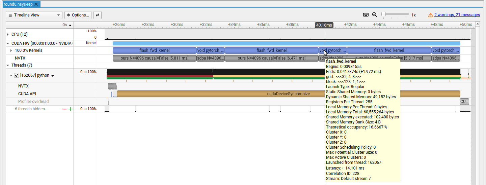

What I look for in a timeline, in this order:

1. **Gaps in the GPU row.** The row labelled CUDA HW shows when the GPU is running a kernel. If it is idle between kernels, the bottleneck is on the CPU (Python, the launcher, synchronisation), and no amount of kernel tuning will help.
2. **How many kernels each call launches**, and which of them takes the time.
3. **The kernel's duration next to a reference** that does the same work on the same inputs.

What this timeline shows:

- **No gaps.** The GPU row is solid from the first kernel to the last. On the CPU thread, the NVTX ranges are tiny ticks at the very start, followed by one long `cudaDeviceSynchronize`: Python queued all six launches in well under a millisecond and then waited for the GPU. Hovering a kernel shows its launch latency, the time between the launch call and the kernel starting. For the SDPA kernel under the cursor it is 14.1 ms: the CPU is far ahead. This is a GPU-bound program, so the answer is inside a kernel.
- **One kernel per call.** `flash_fwd_kernel` is the only thing the Triton version launches, so there is nothing else to look at.
- **3× slower than the reference.** Each of my kernels takes 5.8 to 6.5 ms; each of SDPA's takes about 2.0 ms on the same inputs.

The tooltip also answers a question the previous article left open: what does SDPA run on this GPU? Its full kernel name (also in `nsys stats --report cuda_gpu_kern_sum`) is `pytorch_flash::flash_fwd_kernel<Flash_fwd_kernel_traits<64, 128, 128, 4, false, false, cutlass::bfloat16_t, ...>>`: the FlashAttention-2 kernel for head dimension 64, with 128 × 128 tiles and 4 warps. The tooltip adds 128 threads per block, 49,152 bytes of shared memory, 255 registers per thread and a theoretical occupancy of 16.7%. Keep those numbers in mind; Round 1 lands somewhere quite different.

One warning about durations in a timeline. The three runs of my kernel above differ by up to 11%, and my first capture of this timeline, without the one-second warm-up in the driver, showed SDPA at 3.4 ms because the GPU's clock was still ramping up. A single kernel in a timeline is not a benchmark. The timeline is for the shape of the program; the harness is for the time.

### Step 2: the Speed of Light section

Opening the Nsight Compute report on the Details page, the first section is GPU Speed Of Light Throughput. "Speed of light" is NVIDIA's name for the theoretical maximum of each hardware unit, and every number in the section is a percentage of it. The two headline numbers are Compute (SM) Throughput and Memory Throughput. Each is the *maximum* over many sub-units, so the headline alone does not say which unit is busy. The drop-down on the right of the section title switches the chart to GPU Throughput Breakdown, which lists the sub-units:

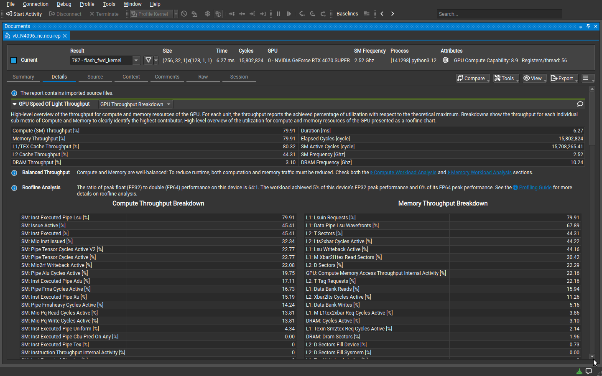

Both headline numbers read 79.9%, and the rule underneath says "Compute and Memory are well-balanced". That sounds healthy. The breakdown says otherwise:

- The top compute entry is `SM: Inst Executed Pipe Lsu` at 79.9%. The LSU (load/store unit) pipe issues memory instructions, and inside an SM that mostly means shared-memory loads and stores. The tensor pipe, which does the matrix multiplies, is at 22.8%.
- The top memory entry is `L1: Lsuin Requests` at 79.9%: the same LSU traffic, seen from the memory side. DRAM is at 3.1%.

So the kernel is busy, but busy moving data around inside each SM, not multiplying it. This is the most important habit with this section: never stop at the headline percentages, always open the breakdown and read the name of the unit at the top.

### Step 3: which instructions keep the LSU busy

Further down the Details page, the Compute Workload Analysis section names the busiest pipeline and, under "Most frequently executed instructions for pipeline LSU", the source lines responsible:

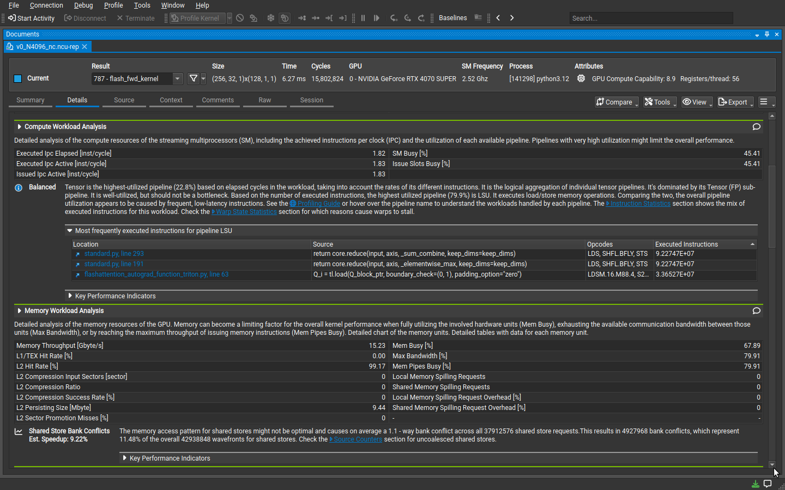

The top two lines are not in my file. They are `standard.py` lines 293 and 191: Triton's own implementations of `tl.sum` and `tl.max`, which the kernel calls for the running row sum and the row maximum. Their opcodes, `LDS`, `SHFL.BFLY` and `STS`, are shared-memory loads, warp shuffles and shared-memory stores. Each of them ran 92 million times. A row reduction that stays inside one warp needs only shuffles. One that needs shared memory is combining partial results across warps, which means the rows of the score tile are split across warps. The third line is the load of `Q`, as `LDSM` (load from shared memory into the matrix-multiply registers), 34 million times.

### Step 4: why the warps wait

The Warp State Statistics section shows, for every instruction issued, how many cycles a warp spent waiting and why:

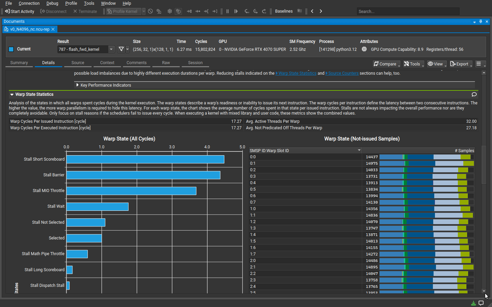

The longest waits, per issued instruction:

| Stall reason | Cycles | What it means |
|---|---|---|
| Short scoreboard | 4.5 | waiting for the result of a shared-memory access (or a special-function op like `exp`) |
| Barrier | 4.4 | waiting at a `__syncthreads()` for the other warps of the program |
| MIO throttle | 3.7 | the queue for shared-memory instructions is full |
| Wait | 1.8 | a fixed-latency dependency between two instructions |
| Math pipe throttle | 0.6 | the target math pipe (here mostly the tensor pipe) is busy |

For comparison, the same section for SDPA's kernel has one dominant reason, math pipe throttle at 6.8 cycles. That is what a healthy compute-bound kernel looks like: its warps wait because the tensor cores are busy. The baseline's warps wait on shared memory and on each other.

### Step 5: the roofline

The same drop-down on the Speed Of Light section offers several roofline charts. For a kernel built on `tl.dot` with bf16 inputs, the one that matters is Roofline Tensor Core:

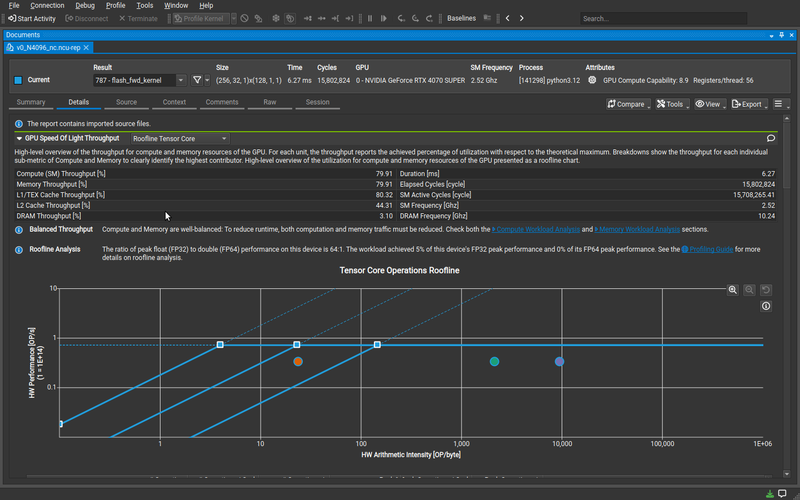

How to read it:

- The horizontal axis is **arithmetic intensity**: operations per byte moved. The vertical axis is achieved operations per second. Both are logarithmic.
- The flat line is the tensor-core peak, 72.2 TOP/s. The three sloped lines are bandwidth limits for L1, L2 and DRAM, from left to right: at a given intensity, no kernel can be faster than bandwidth × intensity. The corner where each sloped line meets the flat line is that level's **ridge point**.
- Each dot is the kernel measured against one level of the memory hierarchy: the same operation count, divided by the bytes that moved through L1, L2 or DRAM. Hovering a dot names its level; here the orange dot is L2, the green one DRAM and the purple one L1.
- A dot sitting on a sloped line is bound by that level's bandwidth. A dot on the flat line is compute-bound. A dot below both lines, like these, is limited by something else, usually latency or instruction issue, which is what Steps 2 to 4 found.

Two numbers in this chart are worth checking by hand, because they turn the picture into a diagnosis.

**The bytes.** The L2 dot sits at 23.9 operations per byte, almost exactly on the L2 ridge. Dividing the operation count by that intensity, or reading `l1tex__m_xbar2l1tex_read_bytes` on the Raw page, puts the traffic from L2 into the SMs at 8.6 GB. That number can be predicted. Each program owns 16 query rows and reads every key and value of its head, 4096 × 64 × 2 bytes each for K and V, so 1 MB. There are 4096 / 16 = 256 query tiles for each of the 32 heads, 8,192 programs in all, so 8,192 × 1 MB = 8.6 GB. K and V for all 32 heads take 33.5 MB, which fits in the 48 MB L2, so the L2 hit rate is 99.2% and DRAM sees only 96 MB. DRAM does not matter for this kernel on this card. L2 does: with 16-row tiles, the kernel moves so much through L2 that even with perfect issue it could not go much past the L2 ridge. Every doubling of the query tile halves those 8.6 GB.

**The operations.** The table under the chart says the tensor cores executed 206 G operations. The algorithm needs 4 × (B·H) × N² × D = 4 × 32 × 4096² × 64 = 137.4 G, which is the number the harness divides by. The hardware did 1.5 times the work the algorithm needs. SDPA's report shows exactly 137.4 G. Comparing the operation count the hardware reports with the one the algorithm needs is cheap, and it is the quickest way to find work that should not be there.

### Step 6: ask the compiler why

The 1.5× and the shared-memory reductions have the same cause, and the TTGIR shows it. The layout Triton chose for the result of the first `tl.dot` is:

```
#mma = #ttg.nvidia_mma<{versionMajor = 2, versionMinor = 0, warpsPerCTA = [1, 4], instrShape = [16, 8]}>
```

`instrShape = [16, 8]` is the shape of one tensor-core instruction's output, 16 rows by 8 columns. `warpsPerCTA = [1, 4]` says the 4 warps of the program are laid side by side along the key axis, 1 × 4. A 16 × 16 score tile is only two 16 × 8 blocks wide, so warps 2 and 3 compute the same blocks as warps 0 and 1. That doubles the `Q Kᵀ` multiply. The `P V` multiply has a 16 × 64 output, 8 blocks wide, enough for every warp, so it is not duplicated: 2 + 1 = 1.5 times the work. And because each row of the score tile is spread over warps, `tl.max` and `tl.sum` must combine partial results through shared memory with a barrier, which are the `STS`, `LDS` and barrier stalls above. The TTGIR also contains a `ttg.local_alloc` of `P` in the `#mma` layout: `P` itself makes a round trip through shared memory before the second `tl.dot`. I come back to that in [the P cast](#pcast).

### The diagnosis

Everything points to one cause: **a 16 × 16 tile is too small for 4 warps**. The 4 warps cannot each get their own rows, so they duplicate tensor-core work and synchronise through shared memory on every row reduction. On top of that, 16-row tiles make every program re-read 1 MB of K and V from L2 for 16 rows of output.

Nsight Compute's own top suggestion, theoretical occupancy (the 66.7% limit from shared memory), would not have helped: more resident warps of a kernel that is limited by its own shared-memory instructions would only queue more shared-memory instructions. The tuned kernel in Round 1 runs at half that occupancy and three times the speed.

<a id="round1">
## Round 1: tile sizes, `num_warps` and `num_stages`
</a>

Round 0 says the tile is too small for its warps. Before sweeping, it helps to know what each knob changes, and what limits how far each one can go.

- **`Q_TILE_SIZE`**: query rows per program. Every program streams all of K and V through the SM once, so the L2 traffic is proportional to N / `Q_TILE_SIZE`. Bigger is better for traffic, but the fp32 output accumulator `O_acc` (`Q_TILE_SIZE` × D) and the score tile (`Q_TILE_SIZE` × `K_TILE_SIZE`) live in registers, and the program count drops, which matters at small N.
- **`K_TILE_SIZE`**: keys per step of the inner loop. Bigger tiles mean fewer loop iterations and bigger matrix multiplies, at the cost of registers for the score tile and shared memory for each K and V buffer.
- **`num_warps`**: how many warps (groups of 32 threads) share one program's tile. Round 0 showed what happens when the tile cannot give each warp its own rows.
- **`num_stages`**: how many K and V tiles are in flight. Triton's software pipeliner turns the loads in the loop into asynchronous copies into shared memory, issued `num_stages - 1` iterations ahead, so the next tiles arrive while the current one is being multiplied. More stages hide more latency and cost more shared memory.

<a id="budget">
### The shared-memory budget for an Ada SM
</a>

Shared memory is what decides which configurations can launch at all, so it is worth knowing exactly what the kernel keeps there. The TTGIR of the configuration that eventually wins (64 × 32 tiles, 4 warps, 3 stages) allocates three buffers:

```
%Q_i = ttg.local_alloc %Q_i_53 : (tensor<64x64xbf16, #blocked>) -> !ttg.memdesc<64x64xbf16, #shared, #smem>
%K_j = ttg.local_alloc : () -> !ttg.memdesc<2x32x64xbf16, #shared, #smem, mutable>
%V_j = ttg.local_alloc : () -> !ttg.memdesc<2x32x64xbf16, #shared, #smem, mutable>
```

- **The Q tile**, `Q_TILE_SIZE` × D bf16 values. The kernel loads `Q_i` once, but Triton parks it in shared memory and re-reads it in every iteration (`ttg.local_load`, `LDSM` in the machine code) as the left-hand operand of `Q Kᵀ`, rather than holding it in registers for the whole loop.
- **The K and V buffers**, `num_stages - 1` of each, `K_TILE_SIZE` × D bf16 values per buffer. `2x32x64` is two buffers of a 32 × 64 tile: three stages means two tiles in flight while the third is in registers being multiplied. The copies into them are `ttg.async_copy_global_to_local`, which becomes `LDGSTS` (load global, store shared, without passing through registers).
- **Nothing for `S`, `P`, `O`, `m` or `l`**: those live in registers, provided the warps own whole rows. When they do not, `P` makes a round trip through shared memory, which is the extra `ttg.local_alloc ... #mma` from Round 0.

For bf16 inputs (2 bytes) and D = 64, that gives a budget equation:


\text{shared bytes} = \underbrace{2 \cdot D \cdot Q_{\text{tile}}}_{Q} + (\text{stages} - 1) \cdot \underbrace{2 \cdot 2 \cdot D \cdot K_{\text{tile}}}_{K\ \text{and}\ V} = 128 \cdot \big(Q_{\text{tile}} + 2(\text{stages} - 1) K_{\text{tile}}\big)


and two limits from the table at the top:

- **One program must fit**: shared bytes ≤ 101,376. Triton checks this when it loads the kernel and raises `OutOfResources` if not.
- **Programs per SM**: the 102,400 bytes of an SM are shared by every resident program, and each also costs 1,024 bytes of driver reservation, so at most ⌊102,400 / (shared bytes + 1,024)⌋ programs fit at once.

Registers give a second, independent limit. Each SM has 65,536 registers, handed out in blocks of 8 per thread, so at most ⌊65,536 / (registers rounded up to a multiple of 8 × 32 × `num_warps`)⌋ programs fit. The registers a configuration needs are only known after compiling, but most of them hold the two fp32 accumulators, (`Q_TILE_SIZE` × `K_TILE_SIZE` + `Q_TILE_SIZE` × D) values spread over 32 × `num_warps` threads. When that alone passes 255 per thread, the compiler spills to local memory (which lives in DRAM, behind the caches), and the kernel slows down sharply.

Here is the arithmetic for a few configurations, next to what Triton reported in `compiled.metadata.shared`, `n_regs` and `n_spills`, and the speed the sweep below measured at N = 4096:

| Q × K tile, warps, stages | Shared memory (formula) | Measured | Programs / SM (shared) | Registers / thread | Programs / SM (registers) | TFLOP/s |
|---|---|---|---|---|---|---|
| 16 × 16, 4, 3 (baseline) | 10,240 | 10,752 (+512 for `P`) | 8 | 56 | 9 | 21.8 |
| 64 × 32, 4, 3 | 24,576 | 24,576 | 4 | 127 | 4 | 63.5 |
| 64 × 32, 4, 5 | 40,960 | 40,960 | 2 | 127 | 4 | 61.9 |
| 128 × 64, 8, 4 | 65,536 | 65,536 | 1 | 146 | 1 | 61.9 |
| 128 × 128, 8, 3 | 81,920 | 81,920 | 1 | 207 | 1 | 60.5 |
| 128 × 128, 8, 4 | 114,688 | does not fit | 0 | | | |
| 256 × 64, 16, 5 | 98,304 | 98,304 | 1 | 128 (4 spilled) | 1 | 61.3 |
| 64 × 256, 4, 2 | 73,728 | 73,728 | 1 | 255 (152 spilled) | 2 | 33.4 |

Across the whole sweep, the formula matches `compiled.metadata.shared` byte for byte for every configuration whose warps own whole 16-row slices of the query tile. The exceptions are the ones where Triton spreads the warps along the key axis, and there the difference is the buffer for `P`.

Three things stand out. First, the classic FlashAttention-2 choice of 128 × 128 tiles fits on Ada only up to 3 stages, and then a single program fills the SM. Second, the configurations that run fastest are not the ones that use the most shared memory: 64 × 32 with 3 stages uses a quarter of the budget, which lets four programs share each SM and hide each other's latency. Third, registers bind as often as shared memory does: 128 × 64 with 8 warps and 3 stages would fit two programs by shared memory (49,152 bytes each), but its 146 registers per thread allow only one, and a 256-key tile spills no matter how much shared memory is left.

<a id="sweep">
### The sweep
</a>

The configuration space is small enough to measure exhaustively: 5 query tiles × 5 key tiles × 5 warp counts × 5 stage counts = 625 configurations, at each of the harness's 8 shapes (N = 512 to 4096, causal and not). `sweep.py` times each one exactly the way the harness does: `FlashAttentionTriton.apply` under `triton.testing.do_bench`, median, same inputs. Every configuration is also checked against SDPA once per shape, so a fast-but-wrong configuration cannot win.

```python
TILES = (16, 32, 64, 128, 256)
WARPS = (1, 2, 4, 8, 16)
STAGES = (1, 2, 3, 4, 5)
CONFIGS = list(itertools.product(TILES, TILES, WARPS, STAGES))

for causal in (False, True):
    for N in (512, 1024, 2048, 4096):
        q, k, v = (torch.randn(B * H, N, D, device="cuda", dtype=torch.bfloat16) for _ in range(3))
        ref = F.scaled_dot_product_attention(q, k, v, is_causal=causal)
        for bq, bk, nw, ns in CONFIGS:
            try:
                ck = launch(q, k, v, causal, bq, bk, nw, ns)     # returns the compiled kernel
            except triton.runtime.errors.OutOfResources:
                record("out_of_smem"); continue
            FlashAttentionTriton.Q_TILE_SIZE, FlashAttentionTriton.K_TILE_SIZE = bq, bk
            FlashAttentionTriton.NUM_WARPS, FlashAttentionTriton.NUM_STAGES = nw, ns
            o = FlashAttentionTriton.apply(q, k, v, causal)
            if not torch.allclose(o, ref, atol=2e-2, rtol=2e-2):
                record("wrong"); continue
            ms = triton.testing.do_bench(lambda: FlashAttentionTriton.apply(q, k, v, causal),
                                         return_mode="median")
            record("ok", ms, ck.n_regs, ck.n_spills, ck.metadata.shared)
```

For the sweep, the only change to the kernel file is that `forward` reads the four values from class attributes and passes `num_warps` and `num_stages` to the launch, which the previous version left at Triton's defaults of 4 and 3.

Two practical details made the sweep take 10.5 minutes instead of over an hour. Compilation dominates when every configuration is new, so `sweep.py` first compiles all of them in 6 worker processes with `flash_fwd_kernel.warmup(...)`, which compiles into Triton's on-disk cache without launching, and only then benchmarks them one at a time in a single process (90 seconds of compiling, then benchmarking). And configurations whose accumulators alone would need more than 512 fp32 registers per thread are skipped without compiling. Configurations just under that line already spill over a thousand registers (128 × 64 with 1 warp spills 1,774 and runs at 2.9 TFLOP/s), so none of the skipped ones could win.

Per shape, 465 configurations ran, 100 did not fit in shared memory, and 60 were skipped by the register estimate. None produced a wrong answer.

<a id="heatmaps">
### The heatmaps
</a>

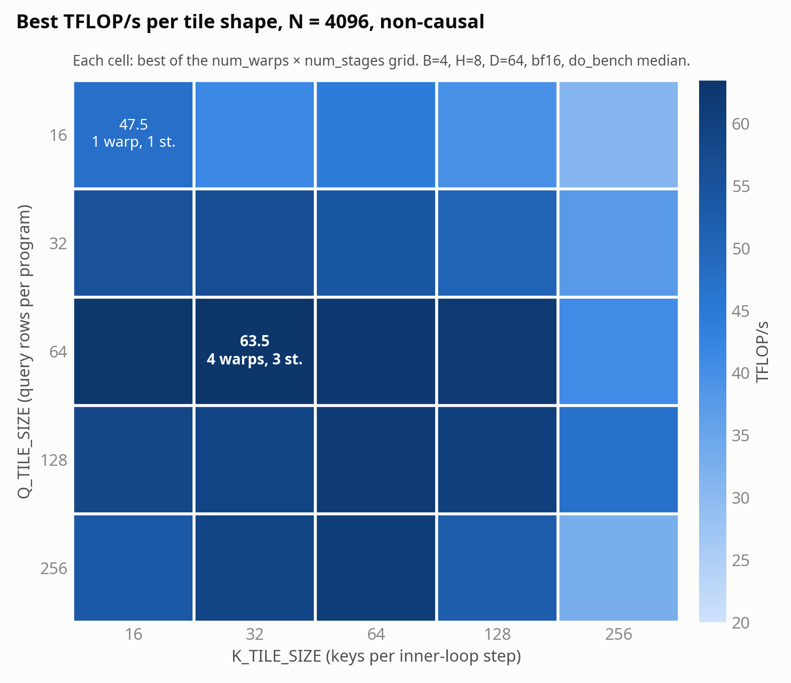

Each cell is the best of the 25 `num_warps` × `num_stages` combinations for that tile shape, at N = 4096, non-causal. The winner is 64 × 32 with 4 warps and 3 stages at 63.5 TFLOP/s, against 21.8 for the baseline configuration. But the most surprising cell is the top-left one: the same 16 × 16 tile as the baseline reaches 47.5 TFLOP/s with 1 warp instead of 4. More than half of the gap to SDPA was the warp count, not the tile size.

That generalises. Taking the best result over key tiles and stages for each query tile and warp count:

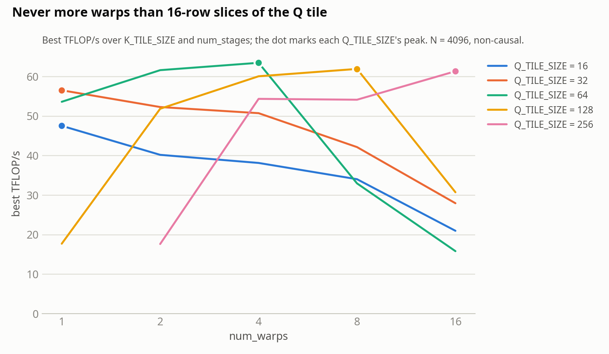

Every query tile peaks at `num_warps` = `Q_TILE_SIZE` / 16 or just below it: 1 warp for 16 rows, 4 for 64, 8 for 128, 16 for 256. One warp more and the speed collapses: 64-row tiles drop from 63.5 to 33.0 TFLOP/s with 8 warps, and 128-row tiles from 61.9 to 30.7 with 16. The reason is the tensor-core instruction shape. One `mma` produces 16 rows, so a warp's natural share of the tile is a multiple of 16 rows. With more warps than 16-row slices, Triton has two choices, and the TTGIR shows it takes both, depending on the shape. For 16 × 16 with 4 warps it lays the warps along the key axis (`warpsPerCTA = [1, 4]`), which is Round 0's duplicated multiplies and shared-memory reductions. For 64 × 32 with 8 warps it stacks all 8 along the query axis (`warpsPerCTA = [8, 1]`), which covers 128 rows of a 64-row tile, so every 16-row slice is computed by two warps. Round 2 confirms this with the operation counter. In the other direction, fewer warps than slices means each warp owns more rows and needs more registers: 128-row tiles with 2 warps sit at the 255-register ceiling (51.8 TFLOP/s), and with 1 warp they spill heavily (17.7).

For the winning tile, the warps and stages:

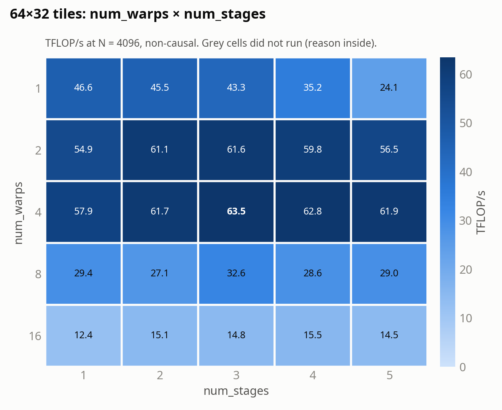

The 4-warp row is the only good one. Along it, going from 1 stage (no pipelining) to 3 is worth 10% (57.9 to 63.5 TFLOP/s); 4 and 5 stages are slightly slower again. The extra buffers cut the number of programs per SM from 4 to 3 and then 2, and by then the copies are apparently already early enough that more of them do not help.

Finally, does the winner depend on N? Repeating the first heatmap at every sequence length:


The 64 × 32 tile wins at every N. Only the stage count moves: 4 stages are best at N = 512. The causal sweep gives the same picture at half the TFLOP/s, because this version of the kernel still computes every tile; its winners are 64 × 32 at N ≤ 2048 and 64 × 16 at N = 4096, all with 4 warps. At these shapes on this GPU, one configuration is within about 2% of the best everywhere. That will matter when deciding whether autotuning is worth its cost.

<a id="winner">
### The winner, through the unchanged harness and tests
</a>

`kernels/v1_tiles` hard-codes the winner. The kernel body is unchanged; the class attributes and the launch change:

```python
class FlashAttentionTriton(torch.autograd.Function):
    # The sweep winner on an RTX 4070 SUPER (bf16, D = 64): 4 warps x 16 rows = 64 rows,
    # and 64*64*2 + (3-1) * 2 * 32*64*2 = 24,576 bytes of shared memory per program.
    Q_TILE_SIZE = 64
    K_TILE_SIZE = 32
    NUM_WARPS = 4
    NUM_STAGES = 3

    @staticmethod
    def forward(ctx, Q, K, V, is_causal=False):
        ...
        grid = (triton.cdiv(N_q, FlashAttentionTriton.Q_TILE_SIZE), B)
        # The tuned config assumes bf16 rows of D = 64 (128 bytes). fp32 at D = 128 has
        # 512-byte rows: with 3 stages Triton asks for 107,520 bytes of shared memory,
        # more than the 101,376 an Ada block may have, so drop to 2 stages there.
        num_stages = FlashAttentionTriton.NUM_STAGES if D * Q.element_size() <= 256 else 2

        flash_fwd_kernel[grid](
            ...,
            Q_TILE_SIZE=FlashAttentionTriton.Q_TILE_SIZE,
            K_TILE_SIZE=FlashAttentionTriton.K_TILE_SIZE,
            is_causal=is_causal,
            num_warps=FlashAttentionTriton.NUM_WARPS,
            num_stages=num_stages,
        )
```

The `num_stages` line was not in my first attempt. With only the four class attributes changed, the unchanged test file failed one case out of twenty:

```
FAILED test_flashattention_triton.py::test_forward_matches_sdpa[1-200-96-128-False-dtype0]
E   triton.runtime.errors.OutOfResources: out of resource: shared memory, Required: 107520, Hardware limit: 101376.
```

That is fp32 inputs at D = 128. The budget equation above assumed 2-byte values and D = 64. With 4-byte values and D = 128, every tile is four times the bytes: 32 KB for Q and 32 KB for each K + V stage. And with fp32 inputs `tl.dot` uses TF32 instructions, for which Triton lays the warps out along the key axis and adds a buffer for `P`. Three stages need 107,520 bytes, 6 KB over the limit; two stages need 74,752. A configuration tuned for one dtype and head dimension is not automatically valid for another, and the test file, which covers both, caught it. The autotuned version in Round 3 handles this without special cases.

With that fixed, all tests pass, and the unchanged harness gives:

| N | causal | baseline (ms) | v1 (ms) | v1 TFLOP/s | SDPA TFLOP/s | v1 % of SDPA |
|---|---|---|---|---|---|---|
| 512 | no | 0.114 | 0.049 | 43.7 | 32.8 | 133% |
| 1024 | no | 0.385 | 0.150 | 57.5 | 56.7 | 101% |
| 2048 | no | 1.528 | 0.535 | 64.3 | 63.9 | 100% |
| 4096 | no | 6.399 | 2.104 | 65.3 | 68.4 | 95% |
| 512 | yes | 0.106 | 0.047 | 22.8 | 19.4 | 115% |
| 1024 | yes | 0.385 | 0.153 | 28.1 | 35.8 | 78% |
| 2048 | yes | 1.538 | 0.545 | 31.5 | 52.1 | 60% |
| 4096 | yes | 6.427 | 2.164 | 31.8 | 61.3 | 52% |

(These, and every harness table from here on, are medians of three runs of the unchanged harness, with the versions interleaved and a 20-second pause before each run.)

Changing four numbers made the non-causal kernel three times faster: level with SDPA from N = 1024 to 2048, 5% behind at 4096, and ahead at N = 512, where SDPA itself only reaches 33 TFLOP/s. Causal attention got the same 3× and is still half of SDPA, because this kernel still computes every tile. Before fixing that, the profiler should confirm the new picture.

<a id="round2">
## Round 2: profile the tuned kernel
</a>

Same procedure as Round 0, on the tuned kernel. `profile_all.sh` profiles every version and SDPA in one Nsight Compute report, and the report's Summary page lists them side by side. Right-clicking the baseline's row and choosing Add Baseline(s) makes every number on the other pages show its change against the baseline, and every chart draw both kernels.

### Step 1: Speed of Light, with the baseline

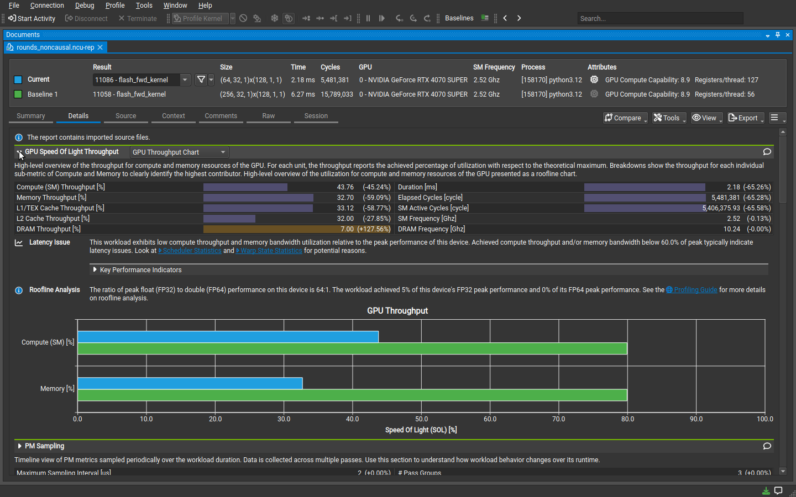

The tuned kernel (blue) takes 2.18 ms against the baseline's 6.27 ms (green), and its headline numbers are *lower*: Compute (SM) Throughput falls from 79.9% to 43.8%, Memory Throughput from 79.9% to 32.7%. Nsight Compute now adds a "Latency Issue" warning, because both are under 60%. Someone reading only these two bars would conclude the tuned kernel is worse. Round 0 already showed why the baseline's high percentages meant nothing: they were the LSU pipe doing work the faster kernel no longer needs.

### Step 2: the breakdown, and a trap in it

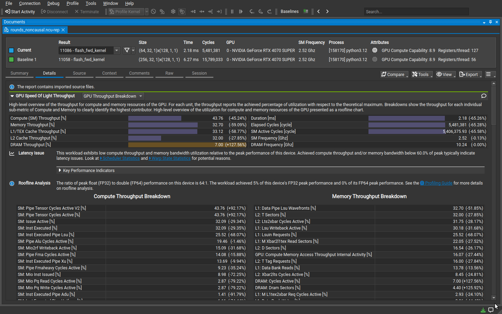

The top compute row is now `SM: Pipe Tensor Cycles Active` at 43.8% (+92% against the baseline), and the LSU pipe has dropped to 25.5% (−68%). The tensor cores are the busiest unit, which is what a matrix-multiply kernel should look like.

But 43.8% is not the whole story, and this is the most important thing I learnt from Nsight Compute on this card. The roofline (next step) says the same kernel runs the tensor cores at **87.5%** of their peak. For every kernel in this article the two numbers differ by exactly a factor of two: 22.8% against 45.5% for the baseline, 43.8% against 87.5% for the tuned kernel, 44.6% against 89.2% for SDPA. My best explanation is that the pipe-utilisation counter is scaled to the rate of fp16 inputs with fp16 accumulation (1,024 operations per clock per SM), twice what bf16 with fp32 accumulation can reach on this card (512). Whatever the cause, the consequence is practical: **for bf16 matrix multiplies with fp32 accumulation on a GeForce Ada card, about 50% on that row means the tensor cores are saturated**, and the "Latency Issue" rule is a false alarm. The roofline divides by the right peak for each data type, so that is where I read how compute-bound a kernel is.

### Step 3: the roofline, with the baseline

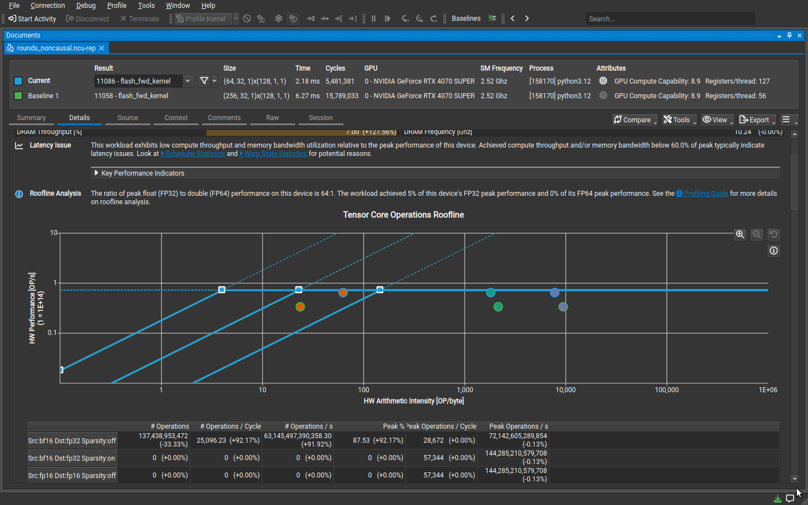

Every dot moved up and to the right, and the tuned kernel's dots now sit on the flat roof. The L2 dot moved from 23.9 to 63.6 operations per byte: the traffic from L2 fell from 8.6 GB to 2.16 GB, exactly the factor of 4 predicted by going from 16-row to 64-row query tiles. The table under the chart has the other prediction: the tensor cores executed 137.4 G operations (−33.3%), exactly what the algorithm needs. The duplicated multiplies are gone. At 87.5% of peak (63.1 TOP/s at the profiler's locked 2.52 GHz), there is little left to gain on the non-causal path.

### Step 4: why the warps wait now

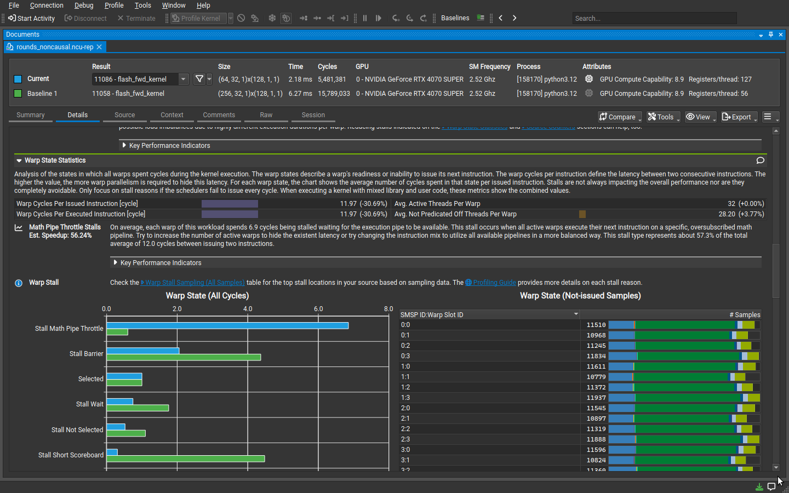

Math pipe throttle is now the longest stall, at 6.9 cycles per instruction: warps are waiting for the tensor cores, the same signature as SDPA. Short scoreboard and MIO throttle, the shared-memory stalls that dominated the baseline, have almost disappeared. Barrier stalls remain at 2.1 cycles, from the synchronisation around the asynchronous K and V copies.

Side by side, with SDPA for reference:

| N = 4096, non-causal | baseline (v0) | tuned (v1) | SDPA |
|---|---|---|---|
| Duration under Nsight Compute | 6.27 ms | 2.18 ms | 2.14 ms |
| Tensor-core operations | 206.2 G | 137.4 G | 137.4 G |
| Tensor-core % of peak (roofline) | 45.5% | 87.5% | 89.2% |
| LSU pipe utilisation | 80.3% | 25.9% | 12.9% |
| Instructions executed | 1,606 M | 394 M | 220 M |
| Registers per thread | 56 | 127 | 255 |
| Shared memory per program | 10.8 KB | 24.6 KB | 49.2 KB |
| Theoretical occupancy | 66.7% | 33.3% | 16.7% |
| Bytes from L2 into the SMs | 8.61 GB | 2.16 GB | 1.35 GB |
| Shared-memory wavefronts | 545 M | 97 M | 40 M |
| Longest stall | short scoreboard | math pipe throttle | math pipe throttle |

Occupancy went down by half and the kernel got three times faster; SDPA runs at half the tuned kernel's occupancy again. Occupancy is a means of hiding latency, not a goal, and a kernel that is waiting on its tensor cores does not need more warps to wait with.

### Step 5: checking the claim about too many warps

Round 1 claimed that with 8 warps on a 64-row tile, Triton stacks the warps along the query axis and every multiply is done twice. One more profile, of the same 64 × 32 kernel with `num_warps=8`, settles it: the tensor cores executed 274.9 G operations, exactly twice the algorithm's 137.4 G, at 89.3% of their peak, and the kernel took 4.26 ms instead of 2.18. The tensor cores were as busy as in the fast kernel. They were doing everything twice. "Busy" and "useful" are different questions, and the operation count is how you tell them apart.

### Step 6: the causal run

The same report for causal attention says the tuned kernel executed 137.4 G tensor operations there too, against the 68.7 G that causal attention needs (and that the harness divides by). Half of the tensor-core work is thrown away by the mask, which is why causal runs at the same speed as non-causal and half of SDPA. That is the largest thing left, and it is inside the inner loop, which is where Round 4 goes. First, though, the last item of the tuning job: autotuning.

<a id="round3">
## Round 3: wrap the winner in `@triton.autotune`, and what it costs
</a>

Hard-coding one configuration has two weaknesses that the sweep and the test file have already shown. The best configuration can depend on the shape (4 stages at N = 512, a 16-key tile for long causal runs), and a configuration can be invalid for a dtype or head dimension it was not tuned on (fp32 at D = 128). Triton's answer is `@triton.autotune`: give it a list of configurations, and on the first call for each new combination of the `key` arguments it compiles and times every configuration on the real inputs, then keeps the fastest for that key.

`kernels/v2_autotune` lists the per-shape winners of the sweep and lets the grid depend on the chosen tile:

```python
# The per-shape winners of the sweep (Q_TILE, K_TILE, num_warps, num_stages). They differ
# only in the pipeline depth and, for long causal runs, the key tile.
AUTOTUNE_CONFIGS = [
    triton.Config({"Q_TILE_SIZE": bq, "K_TILE_SIZE": bk}, num_warps=nw, num_stages=ns)
    for bq, bk, nw, ns in [(64, 32, 4, 3), (64, 32, 4, 4), (64, 32, 4, 2), (64, 16, 4, 5)]
]


# One tuning run per distinct (N_QUERIES, N_KEYS, D, is_causal) and input dtype; Triton adds
# the dtypes of the tensor arguments to the key on its own.
@triton.autotune(configs=AUTOTUNE_CONFIGS, key=["N_QUERIES", "N_KEYS", "D", "is_causal"])
@triton.jit
def flash_fwd_kernel(...):            # the body is unchanged
    ...


class FlashAttentionTriton(torch.autograd.Function):
    @staticmethod
    def forward(ctx, Q, K, V, is_causal=False):
        ...
        # The grid depends on the Q tile the autotuner picks, so it is a function of the config.
        grid = lambda meta: (triton.cdiv(N_q, meta["Q_TILE_SIZE"]), B)
        flash_fwd_kernel[grid](
            Q, K, V, O, L,
            ...,
            D=D,
            is_causal=is_causal,          # no tile sizes, num_warps or num_stages: the config supplies them
        )
```

Three details are easy to get wrong:

- **Everything the configuration sets must be left out of the call.** Passing `Q_TILE_SIZE=` as well raises `Conflicting meta-parameters`.
- **The key decides when to re-tune, not when to recompile.** `N_QUERIES` and `N_KEYS` are ordinary integers, which Triton only specialises on whether they are divisible by 16 (and whether they equal 1), so a new sequence length reuses the compiled kernels and only repeats the timing. `D` and `is_causal` are `tl.constexpr`, so a new value compiles new kernels as well.
- **A configuration that does not fit is skipped, not fatal.** The autotuner catches `OutOfResources` and times that configuration as infinitely slow. For fp32 at D = 128, three of the four configurations need more than 99 KB of shared memory, and the autotuner quietly picks the 2-stage one. The special case in v1's `forward` is no longer needed, and the unchanged test file passes.

The unchanged harness:

| N | causal | v1, fixed (ms) | v2, autotuned (ms) | v2 TFLOP/s | v2 % of SDPA |
|---|---|---|---|---|---|
| 512 | no | 0.049 | 0.045 | 47.7 | 139% |
| 1024 | no | 0.150 | 0.151 | 57.1 | 101% |
| 2048 | no | 0.535 | 0.537 | 64.0 | 100% |
| 4096 | no | 2.104 | 2.130 | 64.5 | 95% |
| 512 | yes | 0.047 | 0.046 | 23.3 | 120% |
| 1024 | yes | 0.153 | 0.154 | 28.0 | 78% |
| 2048 | yes | 0.545 | 0.546 | 31.5 | 61% |
| 4096 | yes | 2.164 | 2.342 | 29.3 | 48% |

Mostly the same speed as the hard-coded winner, as the sweep predicted: 9% faster at N = 512 non-causal, where the 4-stage configuration wins, and equal within noise from 1024 to 2048. But at N = 4096 causal it was 8% *slower* (2.34 ms against 2.16), and its three runs disagreed with each other by 9%.

Asking the autotuner what it chose explains it. With `TRITON_PRINT_AUTOTUNING=1`, three fresh processes picked three different configurations for that shape: (64, 16, 4, 5), then (64, 32, 4, 2), then (64, 32, 4, 3). Timed carefully, the four candidates are within 2 to 8% of each other at that shape, and their order changes from one repetition to the next. The autotuner times each candidate once, for about 100 ms, on a power-limited card whose speed drifts by a few percent. Among near-equal candidates its choice is close to a coin toss, and sometimes the coin lands on the slowest one. An autotuner can only be as precise as its measurements.

### What it costs

The harness does not show the cost of autotuning, because `do_bench` calls the function once before it starts timing, and the tuning happens inside that first call. To measure it, `compile_cost.py` wraps the kernel in `@triton.autotune` with the top 1, 2, 4, 8 or 16 configurations from the sweep (ranked by how close each comes to the best on every shape), and times each call in a fresh process. The calls are, in order: N = 4096, 2048, 1024 and 512 non-causal, then N = 4096 causal. Each run is done twice: first with an empty `TRITON_CACHE_DIR`, then again with the cache the first run left on disk.

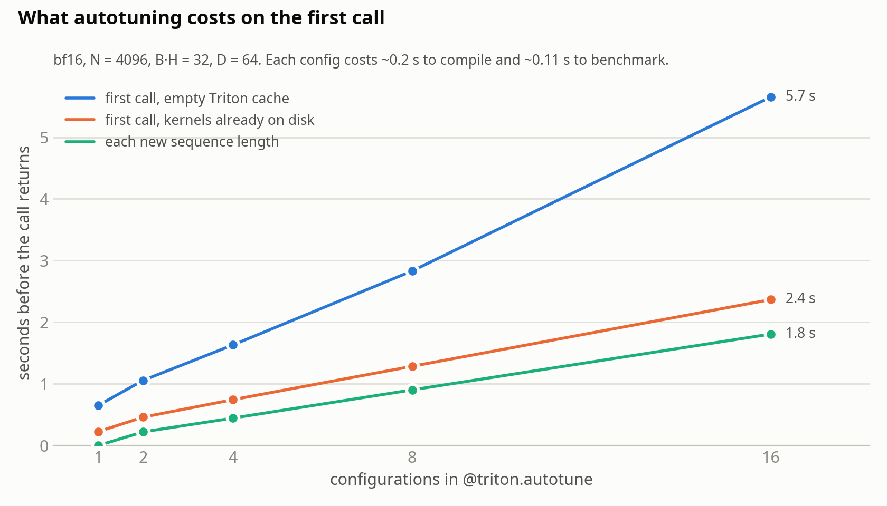

| Configs | First call, empty cache (s) | First call, cache on disk (s) | Each new N (s) | First causal call, empty cache (s) |
|---|---|---|---|---|
| 1 (no tuning) | 0.65 | 0.23 | 0.00 | 0.18 |
| 2 | 1.06 | 0.46 | 0.22 | 0.61 |
| 4 | 1.63 | 0.74 | 0.44 | 1.21 |
| 8 | 2.83 | 1.29 | 0.90 | 2.48 |
| 16 | 5.66 | 2.37 | 1.80 | 5.43 |

The cost is linear in the number of configurations, on top of a fixed start-up cost, and the numbers fit a simple model. The first Triton call in a process costs about 0.47 s with an empty cache directory, because Triton compiles its own C helpers (`cuda_utils` and `__triton_launcher`, which land in the cache), and about 0.22 s with a warm one; a trivial one-line kernel shows the same two numbers. Each configuration then costs about 0.18 s to compile, once per new constexpr combination, and about 0.11 s to time, once per new key, because the autotuner runs `do_bench` (25 ms of warm-up and 100 ms of repetitions) on each one. For 4 configurations and an empty cache that predicts 0.47 + 4 × (0.18 + 0.11) = 1.63 s, which is what I measured. The on-disk cache removes the compile part but not the timing part: a new process re-times every configuration, even for a key it has seen before.

Triton 3.6 can cache the timing results too: `@triton.autotune(..., cache_results=True)` writes the timings for each key next to the compiled kernels. With 4 configurations, the second process's first call took 0.23 s, the same as with no autotuning at all, and later calls with new keys took no time either, because the first process had already tuned them.

End to end, for the two programs this series runs all the time:

| | Fixed configuration (v1) | `@triton.autotune`, 4 configurations (v2) |
|---|---|---|
| Unchanged harness, empty cache | 3.6 s | 8.4 s |
| Unchanged harness, cache on disk | 3.1 s | 6.9 s |
| Unchanged test file, empty cache | 4.4 s | 18.1 s |
| Unchanged test file, cache on disk | 1.7 s | 8.2 s |

The test file suffers most, because it runs 16 different shapes, dtypes and head dimensions, and each is a new key. In a training run with a fixed sequence length, the cost would be paid once and disappear. With variable-length batches, every new length would pay the timing cost again, which is a reason to bucket lengths, round `N` up before calling, or leave `N` out of the key.

Three things help, all available in Triton 3.6:

- **Keep the list short and distinct.** Every configuration costs a compile and a timing run per key, and near-duplicates (the same tile with 3, 4 or 5 stages) mostly add noise to the choice. A sweep like Round 1's tells you which entries earn their place.
- **`cache_results=True`.** Besides saving time, it makes the choice sticky: once a key has been tuned, every later process reuses the same answer instead of re-rolling the dice.
- **Time more carefully.** `@triton.autotune(..., do_bench=lambda fn, quantiles: triton.testing.do_bench(fn, warmup=100, rep=500, quantiles=quantiles))` gives each candidate five times longer, at five times the timing cost.

So for this kernel, on this GPU, at these shapes, autotuning buys at most a few percent of speed, costs several seconds per process, and can make a measurably wrong choice. What it does buy is correctness across inputs the sweep never saw. The trade changes in Round 5, where the inner-loop changes make the best configuration depend on the shape and the mask.

<a id="round4">
## Round 4: inside the inner loop
</a>

Rounds 2 and 3 left two kinds of work in the loop body: work that should not happen at all (the masked tiles of causal attention) and instructions that compete with the tensor cores for issue slots. This round changes the loop body three times, one change at a time. To measure only the change, every A/B comparison here keeps the configuration fixed at Round 1's winner (64 × 32 tiles, 4 warps, 3 stages); autotuning comes back in Round 5.

<a id="skip">
### Causal tile-skipping
</a>

**What the profile said.** Round 2: for causal attention the tuned kernel executes 137.4 G tensor operations where 68.7 G are needed. The timeline says the same thing more bluntly. In this capture of every version, the two launches labelled `v1_tiles causal=True` are exactly as long as the two `v1_tiles causal=False` launches before them:

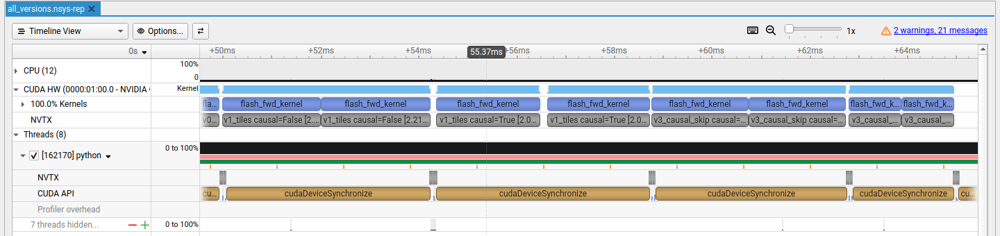

**Why.** The loop visits every key tile, computes `Q Kᵀ`, masks, exponentiates and multiplies by `V`, even when every element of the tile is masked. With 64-row query tiles and 32-key tiles at N = 4096, each head has 64 × 128 = 8,192 tile pairs. Query tile *i* covers rows 64*i* to 64*i* + 63, so it only needs keys up to 64*i* + 63: 2*i* + 2 key tiles. Summed over the 64 query tiles that is 4,160 pairs, 50.8% of the total, and only 128 of them (the two per query tile that straddle the diagonal) need a mask at all. The other 4,032 are fully visible and need no mask; the remaining 4,032 are fully masked and need no work.

**The change.** The loop body moves into a helper, and the kernel calls it twice: once over the key tiles that need no mask, and once over the tiles that straddle the diagonal. Nothing above the diagonal is visited. `MASKED` is a `tl.constexpr`, so Triton compiles two separate loops, and the unmasked one contains no compare, no select and no bounds checks:

```python
@triton.jit
def _attend_key_tiles(
    O_acc, l_acc, m_acc, Q_i, q_pos,
    K_block_ptr, V_block_ptr,
    start, stop, N_KEYS, scale,
    K_TILE_SIZE: tl.constexpr,
    MASKED: tl.constexpr,
    is_causal: tl.constexpr,
):
    # Fold the key tiles [start, stop) into the running state. MASKED is a
    # compile-time flag: the unmasked copy of this loop has no compare, no
    # select and no bounds checks on its loads.
    K_block_ptr = K_block_ptr.advance((start, 0))
    V_block_ptr = V_block_ptr.advance((start, 0))
    for k_start in range(start, stop, K_TILE_SIZE):
        if MASKED:
            K_j = tl.load(K_block_ptr, boundary_check=(0, 1), padding_option="zero")
            V_j = tl.load(V_block_ptr, boundary_check=(0, 1), padding_option="zero")
        else:
            K_j = tl.load(K_block_ptr)
            V_j = tl.load(V_block_ptr)

        S_ij = tl.dot(Q_i, tl.trans(K_j)) * scale          # (Q_TILE, K_TILE), fp32

        if MASKED:
            k_pos = (k_start + tl.arange(0, K_TILE_SIZE))[None, :]
            keep = k_pos < N_KEYS
            if is_causal:
                keep = keep & (k_pos <= q_pos)
            S_ij = tl.where(keep, S_ij, -1e6)

        # ... the online-softmax update and P @ V, unchanged ...

        K_block_ptr = K_block_ptr.advance((K_TILE_SIZE, 0))
        V_block_ptr = V_block_ptr.advance((K_TILE_SIZE, 0))
    return O_acc, l_acc, m_acc
```

and in `flash_fwd_kernel`, after loading `Q_i`:

```python
    q_start = query_tile_index * Q_TILE_SIZE
    q_pos = (q_start + tl.arange(0, Q_TILE_SIZE))[:, None]

    # Key tiles that end at or before full_stop lie entirely inside the tensor.
    full_stop = (N_KEYS // K_TILE_SIZE) * K_TILE_SIZE
    if is_causal:
        # Every key below the first query of this tile is visible to every row,
        # so those tiles need no mask. The tiles that straddle the diagonal get
        # the mask, and nothing beyond the last query of the tile is visited.
        unmasked_stop = tl.minimum((q_start // K_TILE_SIZE) * K_TILE_SIZE, full_stop)
        masked_stop = tl.minimum(q_start + Q_TILE_SIZE, N_KEYS)
    else:
        # Only a ragged last key tile needs the mask.
        unmasked_stop = full_stop
        masked_stop = N_KEYS

    O_acc, l_acc, m_acc = _attend_key_tiles(
        O_acc, l_acc, m_acc, Q_i, q_pos, K_block_ptr, V_block_ptr,
        0, unmasked_stop, N_KEYS, scale,
        K_TILE_SIZE=K_TILE_SIZE, MASKED=False, is_causal=is_causal,
    )
    O_acc, l_acc, m_acc = _attend_key_tiles(
        O_acc, l_acc, m_acc, Q_i, q_pos, K_block_ptr, V_block_ptr,
        unmasked_stop, masked_stop, N_KEYS, scale,
        K_TILE_SIZE=K_TILE_SIZE, MASKED=True, is_causal=is_causal,
    )
```

A few details matter for correctness, and the unchanged test file checks them. The diagonal range starts at `(q_start // K_TILE_SIZE) * K_TILE_SIZE`, rounded down to a key-tile boundary, so the split works when the key tile is larger than the query tile. Both ends are clipped to `N_KEYS`, so ragged key lengths still go through the masked loop with bounds checks. And the non-causal path gets the same treatment: its mask now runs only on a ragged last tile, which also clears item 6 from the previous article's list. And in the first masked tile, every row can see at least that tile's first key, so the `-1e6` sentinel can never become a row's maximum.

**Measure.** The test file passes, and the harness:

| N | causal | v1 (ms) | v3 (ms) | v3 TFLOP/s | v3 % of SDPA |
|---|---|---|---|---|---|
| 512 | yes | 0.047 | 0.038 | 28.4 | 146% |
| 1024 | yes | 0.153 | 0.096 | 44.6 | 124% |
| 2048 | yes | 0.545 | 0.303 | 56.7 | 108% |
| 4096 | yes | 2.164 | 1.097 | 62.7 | 102% |
| 4096 | no | 2.104 | 2.065 | 66.5 | 98% |

Causal attention is twice as fast, and now level with or ahead of SDPA at every length. The non-causal path is 2% faster too, from dropping the mask on interior tiles.

**Profile again.** The same timeline shows the causal launches of v3 (last two) at half the width of everything else. In Nsight Compute, the causal kernel now executes 69.8 G tensor operations: the 68.7 G the algorithm needs plus 1.6% for the diagonal tiles, where half of each tile is computed and then masked. Instructions fell from 428 M to 184 M. SDPA executes 70.9 G here, a little more than v3, because its 128 × 128 tiles waste more on the diagonal.

One idea that did not survive measurement: in causal attention the last query tiles of each head have the most work, and the GPU starts them last, which can leave a tail of busy SMs at the end of the kernel. Reversing the order (`query_tile_index = tl.num_programs(0) - 1 - tl.program_id(0)`) is a common fix. On the kernel with all three changes in this round it moved the causal time at N = 4096 from 1.079 ms to 1.072 ms, which is inside the noise, so it is not in the kernel. My guess is that with 2,048 programs per launch and 224 running at a time, the tail is a small part of the total.

<a id="exp2">
### `exp2`
</a>

**What the profile said.** Nsight Compute's Source page shows the Python source next to the machine code, with a count of executed instructions for every line. For v3, one line of the loop accounts for 28.6% of every instruction the kernel executes:

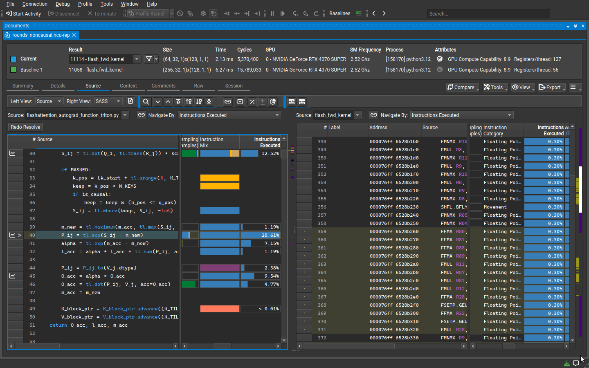

That line is `P_ij = tl.exp(S_ij - m_new)`. Selecting it highlights its SASS on the right, and the opcodes there are not one `MUFU.EX2` per element, as you might hope, but a mix of `FFMA`, `FMUL`, `FSETP.GEU` and `MUFU.EX2`. The PTX explains why. `tl.exp(x)` compiles to:

```
mul.f32         %r485, %r453, 0f3FB8AA3B;   // x * log2(e), 0f3FB8AA3B is 1.4426950
ex2.approx.f32  %r486, %r485;               // 2^x
```

The GPU has no natural exponential instruction, only `ex2` on the special-function unit (`MUFU`), so `exp(x)` becomes `2^(x · log₂e)`: one hidden multiply per element. And `ex2.approx.f32` without `.ftz` must handle results too small for a normal float (below 2⁻¹²⁶), so `ptxas` wraps every `MUFU.EX2` in a range check and two fix-ups. Per element, with the registers renamed for readability (the real code interleaves several elements), v3's SASS does this:

```
FSETP.GEU.AND  P0, PT, R1, -126, PT       // will 2^x be a denormal?
@!P0 FMUL      R1, R1, 0.5                 // if so, halve the exponent ...
MUFU.EX2       R2, R1                      // 2^x
@!P0 FMUL      R2, R2, R2                  // ... and square the result
```

Add the softmax scale, which the kernel multiplies into every score on the line before (`S_ij = tl.dot(...) * scale`), and the subtraction of the row maximum, and each score pays for a scale, a subtraction, a multiply by log₂e, a compare, up to two fix-ups and the `MUFU.EX2` itself (the compiler fuses some of the multiplies and subtractions into `FFMA`s).

**The change.** Fold the scale and log₂e into one constant, `qk_scale = scale · log₂e`, keep the running max `m` in log₂ units of the scaled scores, and call `tl.math.exp2` directly. Because `qk_scale` is positive, the row maximum of the raw scores times `qk_scale` is the maximum of the scaled ones, so the scale is applied to `Q_TILE_SIZE` maxima instead of `Q_TILE_SIZE × K_TILE_SIZE` scores, and the subtraction fuses with the multiply:

```python
        S_ij = tl.dot(Q_i, tl.trans(K_j))                   # raw scores, not yet scaled
        # ... mask as before ...

        # m is kept in log2 units of the scaled scores. qk_scale > 0, so the
        # row max of the raw scores times qk_scale is the max of the scaled ones,
        # and the scale is applied to Q_TILE values here instead of Q_TILE * K_TILE.
        m_new = tl.maximum(m_acc, tl.max(S_ij, axis=1, keep_dims=True) * qk_scale)
        # One FFMA and one ex2 per score: exp(scale*s - m) == 2^(s*qk_scale - m').
        P_ij = tl.math.exp2(S_ij * qk_scale - m_new)
        alpha = tl.math.exp2(m_acc - m_new)
```

with, outside the loop,

```python
    # Fold log2(e) into the softmax scale once, so the inner loop can use exp2.
    qk_scale = scale * 1.4426950408889634
    ...
    # m and log2(l) are in log2 units; the backward pass expects natural-log L.
    L_i = tl.reshape((m_acc + tl.math.log2(l_acc)) * 0.6931471805599453, (Q_TILE_SIZE,))
```

The last line matters: the test file checks `L` against `torch.logsumexp`, which is in natural-log units, so `L` has to be converted back (`L = (m + log₂ l) · ln 2`).

**What the compiler did with it.** `tl.math.exp2` compiles to `ex2.approx.ftz.f32`, the flush-to-zero variant, so the range check and fix-ups disappear, and the scale, the subtraction and the multiply become one `FFMA`:

```
FFMA      R79, R79, UR21, -R5              // s * qk_scale - m
MUFU.EX2  R89, R89                         // 2^x
```

Across the whole compiled kernel (both loops), `FMUL` instructions fell from 320 to 177 and `FSETP.GEU` from 44 to 0. Flushing to zero is safe here: an element of `P` below 2⁻¹²⁶ is added to a row sum that already contains at least one 1 (the row maximum's own term, 2⁰), so it could never change the result.

**Measure.** The test file passes (including `L`). The harness:

| N | causal | v3 (ms) | v4 (ms) | v4 TFLOP/s | v4 % of SDPA |
|---|---|---|---|---|---|
| 1024 | no | 0.147 | 0.144 | 59.5 | 105% |
| 4096 | no | 2.065 | 2.016 | 68.2 | 99% |
| 1024 | yes | 0.096 | 0.092 | 46.6 | 130% |
| 4096 | yes | 1.097 | 1.077 | 63.8 | 104% |

About 2 to 4%: the small win the previous article expected.

**Profile again.**

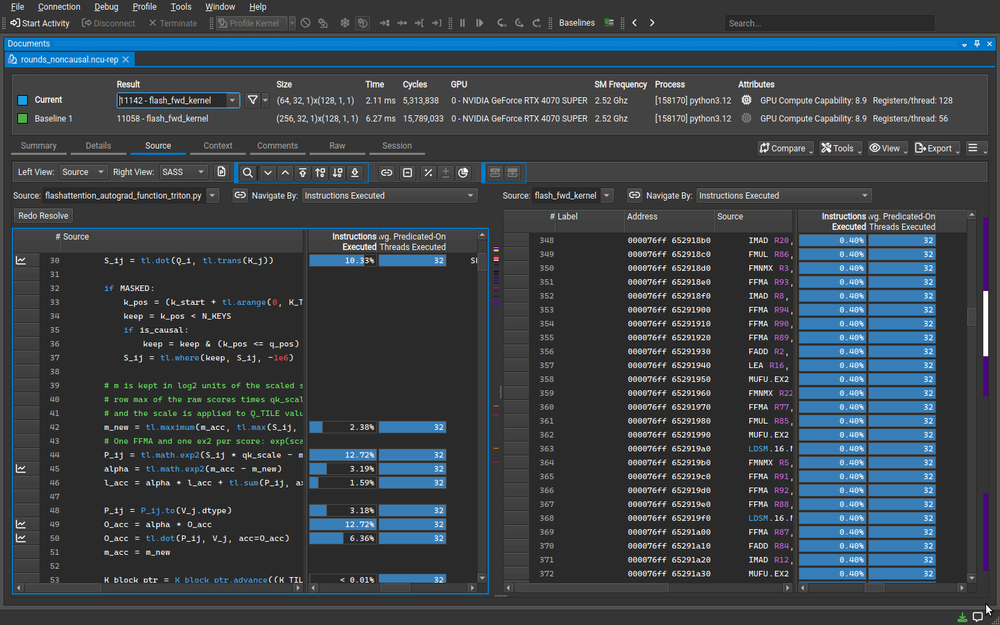

The `exp2` line is down to 12.7% of a smaller total. Executed instructions fell 25%, from 352 M to 264 M (non-causal), and issue-slot utilisation from 29% to 22%. And yet the kernel is only 2% faster. That is the lesson of this change: **instruction count is not time**. The kernel is limited by the tensor cores (the longest stall is still math pipe throttle, now 10.2 cycles), and the removed instructions ran on other pipes, mostly in parallel with the matrix multiplies. They only cost time where they delayed issuing the next `HMMA`.

The new profile also says what the next most expensive line is: `O_acc = alpha * O_acc`, at 12.7%, as large as the exponential now. That rescale costs `Q_TILE_SIZE` × D multiplies per iteration no matter how many keys the iteration covers, so a bigger key tile spreads it over more scores. Remember that for Round 5.

<a id="pcast">
### The P cast
</a>

The previous article's first bug was a cast that did nothing: `P_ij.to(V_j.type.element_ty)` without the assignment. The fix, `P_ij = P_ij.to(V_j.dtype)`, has been in every version since. This section asks what that line costs, where it should go, and whether it should be there at all.

**What it compiles to.** In the TTGIR of the 64 × 32, 4-warp kernel, the line becomes two operations:

```
%P_ij_153 = arith.truncf %P_ij_147 : tensor<64x32xf32, #mma> to tensor<64x32xbf16, #mma>
%P_ij_156 = ttg.convert_layout %P_ij_153 : tensor<64x32xbf16, #mma>
                -> tensor<64x32xbf16, #ttg.dot_op<{opIdx = 0, parent = #mma, kWidth = 2}>>
```

The first is the rounding from fp32 to bf16. The second is a change of layout: `P` comes out of the first `tl.dot` in the layout of an accumulator (`#mma`), and must go into the second `tl.dot` as its left-hand operand (`#ttg.dot_op<{opIdx = 0, ...}>`). In SASS the pair becomes:

```
F2FP.BF16.F32.PACK_AB  R72, R89, R90       // two fp32 values of P -> one register holding two bf16
F2FP.BF16.F32.PACK_AB  R74, R94, R93
F2FP.BF16.F32.PACK_AB  R73, R87, R88
F2FP.BF16.F32.PACK_AB  R75, R92, R91
HMMA.16816.F32.BF16    R68, R72, R28, R68  // R72..R75 are the left operand of P @ V
```

The layout conversion costs nothing: when each warp owns whole 16-row slices, the registers a thread holds as part of the `Q Kᵀ` result are exactly the ones it needs as part of the `P V` operand, so the packed registers go straight into the next tensor-core instruction, with no shared memory and no shuffles in between. The cast is one `F2FP` per two elements, 2.4% of the instructions in the v3 profile above.

That is not automatic. In the baseline configuration (16 × 16, 4 warps), the same line compiled to:

```
%P_ij_146 = arith.truncf %P_ij_140 : tensor<16x16xf32, #mma> to tensor<16x16xbf16, #mma>
%P_ij_147 = ttg.local_alloc %P_ij_146 : (tensor<16x16xbf16, #mma>) -> !ttg.memdesc<16x16xbf16, #shared1, #smem>
%P_ij_150 = ttg.local_load %P_ij_147 : !ttg.memdesc<16x16xbf16, #shared1, #smem>
                -> tensor<16x16xbf16, #ttg.dot_op<{opIdx = 0, parent = #mma, kWidth = 2}>>
```

With the warps side by side along the key axis, no warp holds a whole row of `P`, so `P` is written to shared memory and read back in the operand layout, behind a barrier, on every iteration: the extra 512 bytes in Round 0's shared-memory footprint, and part of its 545 M shared-memory wavefronts. The cost of a cast depends on the layout it converts between, and the layout depends on `num_warps`.

**Where it goes.** The kernel sums `l` from the fp32 `P`, then rounds `P` to bf16 for the multiply by `V`, so the denominator and the numerator see slightly different values of `P`. FlashAttention-2 does the same. The alternative is to round first and sum the rounded values, so the two agree. I timed both and compared each against a float64 reference on the same inputs:

| Variant (N = 4096, non-causal) | Time (ms) | TFLOP/s | Mean absolute error vs float64 |
|---|---|---|---|
| v4: sum fp32 `P`, cast, multiply | 2.025 | 67.9 | 4.52 × 10⁻⁵ |
| cast first, sum the bf16 `P` | 2.057 | 66.8 | 4.52 × 10⁻⁵ |
| no cast: fp32 `P`, `V` upcast, TF32 multiply | 2.886 | 47.6 | 3.01 × 10⁻⁵ |

Casting first changes nothing: the error is dominated by rounding the output to bf16, and the extra conversion back to fp32 for the sum costs a little. The order in the kernel stays.

**Whether it should be there.** The last row removes the cast: `P` stays fp32 and `V` is converted to fp32, so `tl.dot` runs TF32 tensor-core instructions. It delivers 30% fewer TFLOP/s (the kernel takes 43% longer), and the same 30% for causal (44.6 against 63.7 TFLOP/s). The peak table under the roofline chart explains why: on this card the tensor cores do 512 bf16 operations per clock per SM but only 256 in TF32, so with half the FLOPs at half the rate the multiplies take 1.5 times as long. It is more accurate (TF32 keeps 10 mantissa bits to bf16's 7), but bf16 is already well inside the test tolerance. The cast is what keeps the second multiply on the fast path, and it is worth every one of its `F2FP` instructions.

<a id="round5">
## Round 5: re-tune, then the final profile
</a>

Round 1's sweep measured the kernel as it was then. Round 4 changed what each loop iteration costs: the per-score work shrank, so the per-iteration work (the `alpha * O_acc` rescale, the barrier around the asynchronous copies) is a bigger share; and causal programs now do half as much work each. Those are exactly the things the tile sizes trade against each other, so the old winner may no longer be the winner. The same `sweep.py`, pointed at `kernels/v4_exp2`, took 10.8 minutes:

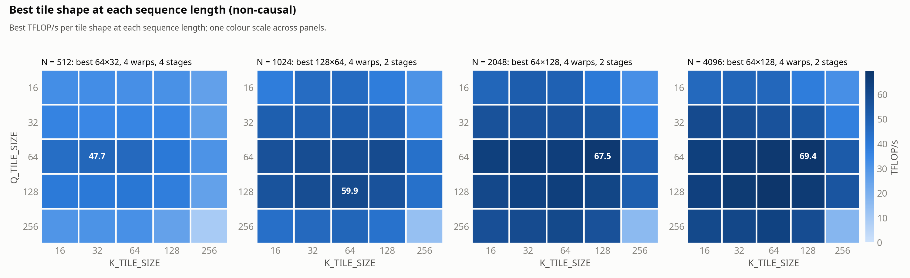

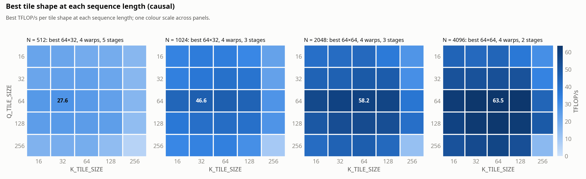

| N | causal | Best configuration (Q × K, warps, stages) | TFLOP/s | 64 × 32, 4, 3 (Round 1's winner) |
|---|---|---|---|---|
| 512 | no | 64 × 32, 4, 4 | 47.7 | 97.8% of best |
| 1024 | no | 128 × 64, 4, 2 | 59.9 | 97.9% |
| 2048 | no | 64 × 128, 4, 2 | 67.5 | 97.3% |
| 4096 | no | 64 × 128, 4, 2 | 69.4 | 94.9% |
| 512 | yes | 64 × 32, 4, 5 | 27.6 | 95.0% |
| 1024 | yes | 64 × 32, 4, 3 | 46.6 | 100% |
| 2048 | yes | 64 × 64, 4, 3 | 58.2 | 99.0% |
| 4096 | yes | 64 × 64, 4, 2 | 63.5 | 98.3% |

This time the best configuration does depend on the shape and the mask. Long non-causal sequences now prefer 128-key tiles, which is what Round 4's profile predicted: four times fewer iterations means four times fewer rescales of `O_acc` and four times fewer barriers for the same work. The price is 255 registers per thread and 40 KB of shared memory, which only pays off when there is plenty of work: short sequences and the causal diagonal (where a wide key tile means more masked waste) still prefer 32 or 64 keys. The warp rule from Round 1 still holds as a ceiling, never more warps than 16-row slices, but with the leaner loop, two slices per warp became competitive too: 128-row tiles now do best with 4 warps, the shape FlashAttention-2 itself uses.

So autotuning finally has something to choose. Round 1's winner is still within about 5% everywhere (97.5% of the best on average), but a short list can do better. Picking configurations greedily to raise the worst shape gives five that are within 1% of the best on every shape, one of which is only there so that fp32 at D = 128 has a configuration that fits:

```python
# From the second sweep (after tile-skipping and exp2), chosen so that every benchmark shape
# is within 1% of its best configuration: 64x32 tiles with 3, 4 or 5 stages for short
# sequences, 64x128 with 2 stages for long non-causal ones, and 64x32 with 2 stages, the
# only one that fits in 99 KB of shared memory for fp32 inputs at D = 128.
AUTOTUNE_CONFIGS = [
    triton.Config({"Q_TILE_SIZE": bq, "K_TILE_SIZE": bk}, num_warps=nw, num_stages=ns)
    for bq, bk, nw, ns in [(64, 32, 4, 3), (64, 32, 4, 4), (64, 32, 4, 5), (64, 128, 4, 2), (64, 32, 4, 2)]
]


@triton.autotune(configs=AUTOTUNE_CONFIGS, key=["N_QUERIES", "N_KEYS", "D", "is_causal"])
@triton.jit
def flash_fwd_kernel(...):            # the v4 body, unchanged
    ...
```

That is `kernels/v5_final`. The unchanged test file passes. The unchanged harness, against the previous article's kernel and SDPA:

| N | causal | baseline (ms) | final (ms) | final TFLOP/s | SDPA TFLOP/s | final % of SDPA |
|---|---|---|---|---|---|---|
| 512 | no | 0.114 | 0.044 | 48.7 | 32.8 | 144% |
| 1024 | no | 0.385 | 0.143 | 59.9 | 56.7 | 106% |
| 2048 | no | 1.528 | 0.507 | 67.8 | 63.9 | 106% |
| 4096 | no | 6.399 | 1.954 | 70.3 | 68.4 | 103% |
| 512 | yes | 0.106 | 0.037 | 29.1 | 19.4 | 150% |
| 1024 | yes | 0.385 | 0.091 | 47.1 | 35.8 | 131% |
| 2048 | yes | 1.538 | 0.293 | 58.7 | 52.1 | 113% |
| 4096 | yes | 6.427 | 1.077 | 63.8 | 61.3 | 104% |

### The final profile

Last loop of the method: profile the final kernel next to SDPA, with SDPA as the baseline.

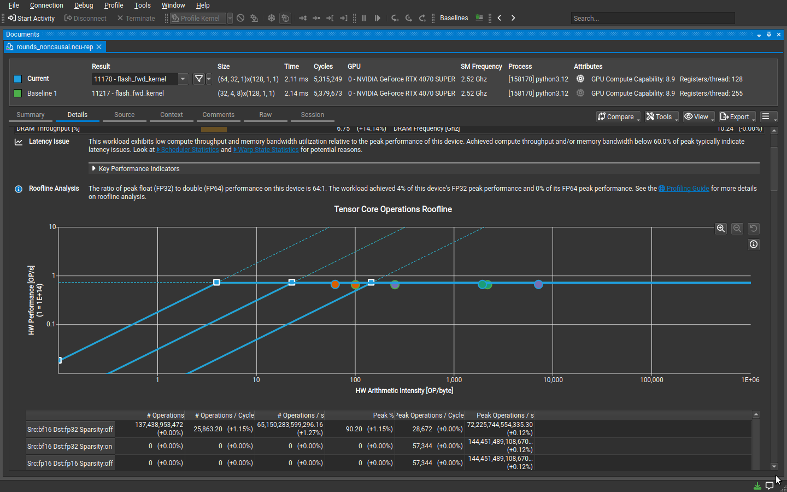

Both kernels sit on the roof. In the profiled process the autotuner picked 64 × 32 tiles with 3 stages for this shape, which reached 90.2% of the tensor-core peak against SDPA's 89.2%, with the same 137.4 G operations. The L2 dots differ: SDPA's 128-row tiles move 1.35 GB through L2 against my 2.16 GB, so SDPA's dot sits further right, but both are far enough right of the L2 ridge that it does not matter here.

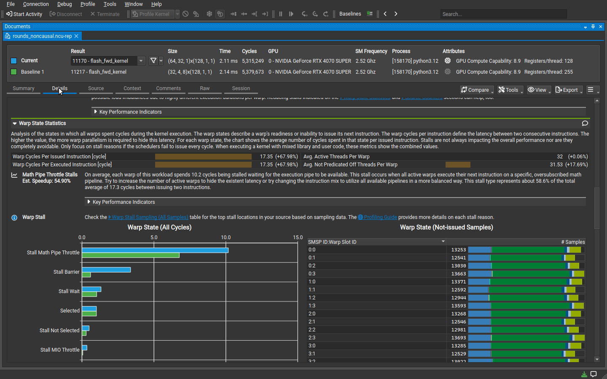

| N = 4096 | final, non-causal | SDPA, non-causal | final, causal | SDPA, causal |
|---|---|---|---|---|
| Duration under Nsight Compute | 2.11 ms | 2.14 ms | 1.15 ms | 1.19 ms |
| Tensor-core operations | 137.4 G | 137.4 G | 70.9 G | 70.9 G |
| Tensor-core % of peak | 90.2% | 89.2% | 85.6% | 82.2% |
| Instructions executed | 264 M | 220 M | 96 M | 114 M |
| Registers per thread | 128 | 255 | 255 | 255 |
| Shared memory per program | 24.6 KB | 49.2 KB | 41.0 KB | 49.2 KB |
| Longest stall | math pipe throttle (10.2) | math pipe throttle (6.8) | math pipe throttle (8.1) | math pipe throttle (6.6) |
| Barrier stall | 3.4 | 0.6 | 0.6 | 0.9 |

(For the causal shape the autotuner picked 64 × 128 tiles with 2 stages, hence the 255 registers and 41 KB.)

What is left is small, and the profile says where it is. Both kernels spend their time waiting for the tensor cores, at about 90% of the peak that bf16 inputs with fp32 accumulation allow on this card. In the non-causal kernel, my warps also wait at barriers for 3.4 cycles per instruction against SDPA's 0.6. The SASS has one `BAR.SYNC` per loop iteration, guarding the shared-memory buffers of the asynchronous copies, and with 32-key tiles each program runs four times as many iterations as SDPA's 128-key ones. That is the same per-iteration overhead that made 128-key tiles win in the re-sweep. The causal run, where the autotuner did pick 128-key tiles, shows it: its barrier stall is 0.6 cycles, the same as SDPA's. That is the next place I would look.

And the whole journey on one timeline, every version at N = 4096, non-causal then causal, each launched twice:

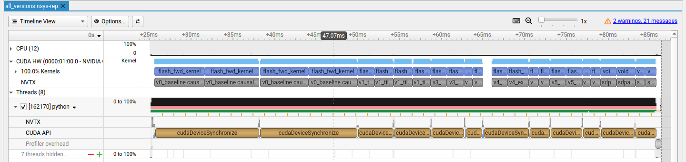

<a id="checklist">
## What to look for, as a checklist
</a>

This is the order I now read profiles in, and what each step has to answer before moving to the next.

**The benchmark**

1. Use the same harness for every comparison, and report medians. On a power-limited consumer card, runs drift by up to 5%, so run twice before believing a 3% difference, and interleave the versions.
2. Decide what "100%" means. For this kernel it is the tensor cores' bf16-with-fp32-accumulation peak (72 TFLOP/s here, half the fp16-accumulation peak on GeForce Ada), checked against a large cuBLAS matmul (69 TFLOP/s).

**The timeline (Nsight Systems)**

3. Is the GPU row solid? Gaps mean the CPU is the bottleneck. A long launch latency in the kernel tooltip means the CPU is comfortably ahead.
4. How many kernels does one call launch, and which takes the time?
5. Compare the kernel with a reference doing the same work, on the same timeline. Warm the GPU up for a second first, and do not quote single launches: one capture had SDPA at 3.4 ms instead of 2.0.

**The kernel (Nsight Compute)**

6. Speed of Light: never stop at the two headline percentages. Open the breakdown and read the name of the unit at the top. In the baseline, the "80% compute, 80% memory" was the load/store unit moving data inside the SM.
7. On GeForce Ada with bf16 inputs and fp32 accumulation, the tensor-pipe row tops out around 50%, and the "Latency Issue" rule fires on kernels that are compute-bound. Read compute-boundness from the tensor-core roofline's "Peak %", which uses the right peak for the data type.
8. Roofline: compare "# Operations" with the algorithm's count. It found duplicated multiplies (1.5× in the baseline, 2× with too many warps) and wasted ones (2× for causal without tile-skipping).
9. Predict the bytes before reading them. L2 traffic was programs × bytes each program reads (8.6 GB, then 2.16 GB) to the digit. When a prediction and a measurement disagree, one of your assumptions is wrong.
10. Warp state: math pipe throttle on top means the tensor cores are the limit, which is where a matrix-multiply kernel wants to be. Short scoreboard, MIO throttle and barrier on top mean shared-memory traffic and synchronisation. Long scoreboard means global-memory latency.
11. Compute Workload Analysis and the Source page: which source lines produce the busiest pipe's instructions, and what share of all instructions each line costs. The Source page found `tl.exp` at 28.6% of the kernel.
12. Launch statistics and occupancy: which limit binds, registers or shared memory. Occupancy is a means, not a goal. The fastest kernels here run at a third or a sixth of the maximum.
13. Treat the "estimated speedup" suggestions as hypotheses. The top two for the baseline (occupancy and bank conflicts) were symptoms of the real problem.

**The compiler (Triton)**

14. `compiled.n_regs`, `n_spills` and `metadata.shared` for the configuration you are about to benchmark, and the budget arithmetic to predict them.
15. In the TTGIR: `warpsPerCTA` in the `#mma` layout (do the warps own whole rows?), any `ttg.local_alloc` or `ttg.convert_layout` in the loop (a round trip through shared memory?), and the `memdesc` shapes of the pipeline buffers.
16. The PTX or SASS of the hottest line. That is where `ex2.approx.f32` and its range check turned up.

**After every change**

17. Profile again, and check the change did what you expected and nothing else. `exp2` cut instructions by 25% and time by 2%, because the kernel was waiting on the tensor cores, not on the instructions it removed.

<a id="results">
## Results
</a>

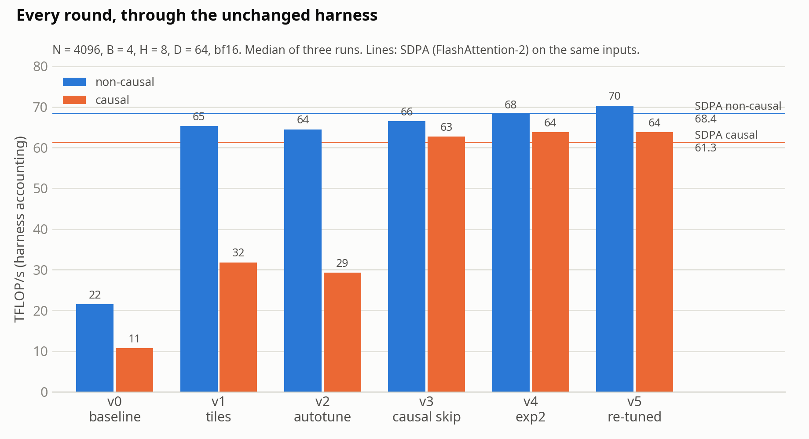

The unchanged harness, medians of three interleaved runs, every version (milliseconds; TFLOP/s and % of SDPA in brackets for the two N = 4096 rows):

| N | causal | v0 baseline | v1 tiles | v2 autotune | v3 causal skip | v4 exp2 | v5 final | SDPA |
|---|---|---|---|---|---|---|---|---|
| 512 | no | 0.114 | 0.049 | 0.045 | 0.049 | 0.048 | 0.044 | 0.066 |
| 1024 | no | 0.385 | 0.150 | 0.151 | 0.147 | 0.144 | 0.143 | 0.152 |
| 2048 | no | 1.528 | 0.535 | 0.537 | 0.523 | 0.514 | 0.507 | 0.538 |
| 4096 | no | 6.399 (21.5, 32%) | 2.104 (65.3, 95%) | 2.130 (64.5, 95%) | 2.065 (66.5, 98%) | 2.016 (68.2, 99%) | 1.954 (70.3, 103%) | 2.008 (68.4) |
| 512 | yes | 0.106 | 0.047 | 0.046 | 0.038 | 0.037 | 0.037 | 0.055 |
| 1024 | yes | 0.385 | 0.153 | 0.154 | 0.096 | 0.092 | 0.091 | 0.120 |
| 2048 | yes | 1.538 | 0.545 | 0.546 | 0.303 | 0.296 | 0.293 | 0.330 |
| 4096 | yes | 6.427 (10.7, 18%) | 2.164 (31.8, 52%) | 2.342 (29.3, 48%) | 1.097 (62.7, 102%) | 1.077 (63.8, 104%) | 1.077 (63.8, 104%) | 1.121 (61.3) |

What each round was worth, at N = 4096:

| Change | Non-causal | Causal | Found by |
|---|---|---|---|
| Tiles, warps and stages (v0 → v1) | 3.0× | 3.0× | Speed of Light breakdown, roofline operation count, TTGIR layout |
| Autotuning the v1 configurations (v1 → v2) | none | 8% slower (a noisy choice) | the harness, then `TRITON_PRINT_AUTOTUNING` |
| Causal tile-skipping (v1 → v3) | 2% | 2.0× | roofline operation count, timeline |
| `exp2` (v3 → v4) | 2% | 2% | Source page, PTX, SASS |
| Re-tuning with autotune (v4 → v5) | 3% | none | a second sweep, motivated by the Source page |

All of it runs with the same unchanged test file passing at every step.

<a id="future">
## Future articles
</a>

Some ideas I have for future articles:
* Backward pass of FA2. It needs the `L` this kernel has been writing all along, and it is a much harder kernel to tile, with two accumulations in different directions.
* The remaining 10%: fewer barriers per tile, and whether a different pipelining structure gets closer to the tensor-core peak on Ada.
* Rewrite the kernel in TileLang and CuTe DSL, now that there is a profile-driven baseline to compare them against.
* The `-1e6` sentinel (item 4 in the previous list) is still in the kernel. Tile-skipping means no row can be fully masked in this kernel, but a kernel with padding masks or sliding windows would need to handle it.
